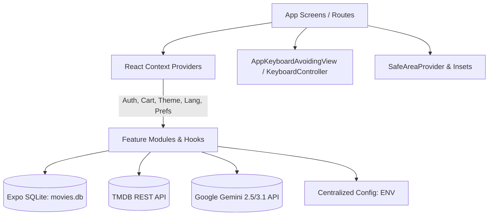
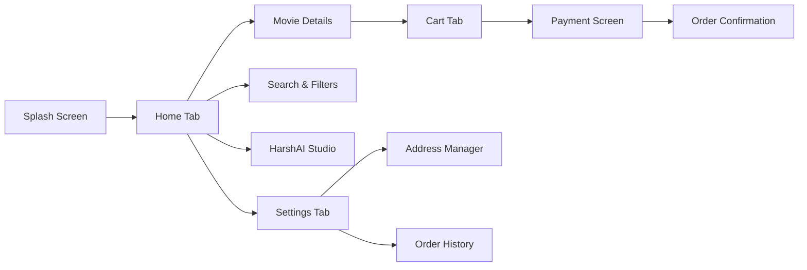

# 🎬 MovieCartReactHarsh

<p align="center">
  
</p>

<p align="center">
  <strong>A Production-Grade Movie Commerce Application built with the latest React Native, Expo, and TMDB.</strong>
</p>

<p align="center">
Discover • Wishlist • Purchase • Manage Orders • Beautiful Animations • Offline Persistence
</p>

<p align="center">


</p>

---
<h1 align="center">

  <a href="https://www.youtube.com/watch?v=62bIsvRcPv0">

    🎥 Watch Full Project Demo on YouTube (Hit me)

  </a>

</h1>
---


# 📱 Application Preview


 


# ✨ About the Project

MovieCartReactHarsh is a **production-ready Movie Store application** that demonstrates how to build a modern, scalable, and premium mobile application using the latest React Native ecosystem.

Unlike a simple movie browsing app, this project delivers a complete commerce experience where users can discover movies, manage wishlists and favorites, purchase original movie copies, track orders, customize their profile, and enjoy polished interactions with native-feeling animations.

The application follows modern architecture, reusable components, clean project organization, and performance-focused development practices, making it an excellent reference for real-world React Native applications.

---

# 🚀 Why This Project?

This project was built to showcase how a modern production application should be structured.

✔ Production Ready

✔ Clean Architecture

✔ Feature-Based Structure

✔ Fully Offline Persistence

✔ Beautiful User Experience

✔ Reusable Components

✔ Smooth Native Animations

✔ Scalable Codebase

✔ Modern Expo Ecosystem

✔ Industry Best Practices

---

# 📦 Built with the Latest React Native Ecosystem

The application uses the latest recommended libraries from the Expo ecosystem to provide maximum compatibility, maintainability, and long-term support.

| Technology | Purpose |
|------------|---------|
| React Native | Cross-platform native application |
| Expo | Modern React Native development platform |
| Expo Router | File-based navigation |
| Expo SQLite | Local production database |
| Expo Image | High-performance image loading |
| Expo Blur | Premium glass effects |
| Expo Haptics | Native tactile feedback |
| Expo Splash Screen | Professional app startup |
| Expo Media Library | Save media locally |
| React Native Reanimated | Smooth 60 FPS animations |
| React Native Gesture Handler | Native gesture interactions |
| TMDB API | Live movie database |

---

# 🎯 Why These Technologies?

### ⚛️ React Native

Develop once and deliver a true native experience on both Android and iOS.

---

### 🚀 Expo

Provides the latest development experience, simplified native integration, OTA updates, and a robust ecosystem maintained by the React Native team.

---

### 🗄 Expo SQLite

A reliable embedded database that stores user information locally without requiring an internet connection.

Used for:

- Authentication
- Cart
- Wishlist
- Favorites
- Orders
- Addresses
- User Settings
- Sessions

---

### 🎥 TMDB API

Provides high-quality movie data including:

- Latest Movies
- Popular Movies
- Movie Posters
- Backdrops
- Cast
- Production Companies
- Similar Movies
- Recommendations
- Official Trailers

---

### ⚡ React Native Reanimated

Creates buttery smooth native animations including:

- Shared Element Effects
- Stretchy Headers
- Parallax Animations
- Fade Animations
- Scale Animations
- Gesture Animations

---

### 👆 Gesture Handler

Enables native touch interactions including:

- Drag
- Pinch to Zoom
- Double Tap
- Swipe Gestures
- Interactive Image Viewer

---

# 🎬 Movie Experience
 
Users can explore an immersive movie experience including:

- Browse Popular Movies
- Browse Latest Movies
- Browse Upcoming Movies
- Infinite Pagination
- Premium Movie Details
- Stretchy Header Animation
- Fullscreen Image Viewer
- Embedded YouTube Trailer
- Production Companies
- Similar Movies
- Recommended Movies
- Movie Gallery
- Cast Information
- Smooth Image Loading
- Native Page Transitions

---

# 🛒 Complete Shopping Experience
 
The application delivers a complete purchasing workflow.

Features include:

- Add to Cart
- Update Quantity
- Remove Products
- Address Management
- Multiple Delivery Addresses
- Delivery Scheduling
- Order Summary
- Payment Interface
- SQLite Order Creation
- Order History
- Order Tracking
- Order Details
- Order Cancellation Before Delivery

---

# ❤️ Personalization
 
Each user has their own personalized experience.

Features include:

- Wishlist
- Favorites
- Edit Profile
- Profile Picture
- Theme Selection
- Persistent Preferences
- Fullscreen Image Viewer
- User Isolation
- SQLite Persistence

---

# 🔐 Authentication System

Authentication is completely powered by SQLite and designed with a scalable multi-user architecture.

Features include:

- Login
- Register
- Forgot Password
- Session Persistence
- Splash Session Restore
- Multi-user Support
- Secure Local Authentication
- Logout

---

# 🗄 SQLite Database

The application stores data locally using SQLite.

Database includes:

- Users
- Sessions
- User Settings
- Addresses
- Wishlist
- Favorites
- Cart
- Orders
- Order Items

Every user has completely isolated data.

---

# 🎨 Premium User Experience
 
Designed to feel like a premium native application.

Highlights include:

- Modern Design
- Glass Effects
- Light Theme
- Dark Theme
- Native Feeling Navigation
- Rich Animations
- Responsive Layouts
- Haptic Feedback
- Smooth Scrolling
- Loading States
- Skeleton Placeholders
- Beautiful Empty States
- Interactive Components

---

# ⚡ Performance Optimizations

Performance has been considered throughout the application.

Implemented optimizations include:

- Optimized FlatLists
- Efficient SQLite Queries
- Lazy Rendering
- Modular Components
- Memoization
- Reduced Re-renders
- Optimized Image Loading
- Feature-Based Structure
- Shared Components
- Scalable Folder Organization

---

# 🏗 Project Architecture

```
src
│
├── app
├── assets
├── components
├── constants
├── context
├── database
├── hooks
├── navigation
├── screens
├── services
├── repositories
├── theme
├── types
├── utils
└── helpers
```

Architecture follows:

- Feature-Based Organization
- Repository Pattern
- Service Layer
- Separation of Concerns
- Reusable Components
- Context-based State Management
- Theme Provider
- Clean Folder Structure

---

# 📱 Application Highlights

✅ Production Ready

✅ Modern UI

✅ Native Animations

✅ Offline First

✅ Multi User

✅ SQLite Database

✅ Theme Support

✅ TMDB Integration

✅ Order Management

✅ Wishlist

✅ Favorites

✅ Responsive Layout

✅ Modular Architecture

✅ Smooth Performance

✅ Expo Best Practices


# 👨‍💻 Developer

## Harsh

**Senior Mobile Application Developer**

Building scalable, production-grade mobile applications with a strong focus on performance, architecture, and user experience.

### Connect with me

📧 Email  
dev.iharsh1008@gmail.com

📱 Phone  
+91 9662108047

💻 GitHub  
https://github.com/dev1008iharsh

💼 LinkedIn  
https://www.linkedin.com/in/dev1008iharsh

---

# ⭐ Final Note

MovieCartReactHarsh represents a complete, production-grade React Native application demonstrating modern architecture, scalable project organization, premium UI/UX, offline-first capabilities, and the latest Expo ecosystem.

This project is intended to showcase professional mobile application development practices and serves as a reference implementation for building high-quality React Native applications.


# 🎬 MovieCart — Production React Native & Expo Application

[](https://docs.expo.dev/)
[](https://reactnative.dev/)
[](https://www.typescriptlang.org/)
[](https://docs.expo.dev/versions/latest/sdk/sqlite/)
[](LICENSE)

A premier, cross-platform movie store and entertainment ecosystem built with **React Native**, **Expo SDK 54**, **Expo Router**, and **Google Gemini AI**. MovieCart combines cinema browsing, physical disc purchasing, local SQLite persistence, interactive AI features, and localized support in English, Gujarati, and Hindi.

---

## 📑 Table of Contents

1. [Architectural Overview](#-architectural-overview)
2. [Folder & Directory Structure](#-folder--directory-structure)
3. [Environment Configuration (.env)](#-environment-configuration-env)
4. [Design System & Theme Tokens](#-design-system--theme-tokens)
5. [Localization (EN, GU, HI)](#-localization-system)
6. [Edge-to-Edge & Safe Area Architecture](#-edge-to-edge--safe-area-architecture)
7. [Keyboard Handling with Keyboard Controller](#-keyboard-handling)
8. [Screen-by-Screen Specification](#-screen-by-screen-specification)
9. [Database Architecture & Data Relationships](#-database-architecture)
10. [AI Studio & Gemini Integration](#-ai-studio--gemini-integration)
11. [Platform-Specific Optimizations](#-platform-specific-optimizations)
12. [Running & Building the Project](#-running--building-the-project)
13. [Coding Standards & Developer Guidelines](#-coding-standards--guidelines)

---

## 🏛️ Architectural Overview

MovieCart follows a **Feature-Sliced Architecture** paired with **Expo Router** file-based navigation, context-driven reactive states, centralized environment configuration, and a local-first offline SQLite database.



### Core Architecture Pillars

1. **Strict File Size Constraints:** Every source code file (`.tsx`, `.ts`) is strictly kept under **500 lines**. Reusable UI elements, hooks, modals, and list items are modularized into dedicated feature directories.
2. **Standardized Path Aliasing (`@/*`):** Clean, scalable import strategy across the entire application using `@/components`, `@/constants`, `@/context`, `@/features`, `@/services`, `@/utils`, and `@/types`.
3. **Local-First SQLite Engine:** All personal user state (favorites, wishlist, cart, delivery addresses, order history, search history, and AI chat threads) is stored locally in `movies.db` with Write-Ahead Logging (WAL) enabled.
4. **Multilingual by Design:** Dynamically switches languages (English, Gujarati, Hindi) across all screens using conversational phrasing.
5. **Resilient Keyboard Management:** Powered by `react-native-keyboard-controller` for smooth iOS and Android transitions without keyboard layout jumping or obscuring inputs.
6. **Environment-Driven Configuration:** External endpoints, API keys, and contact desk URLs are securely driven by `.env` variables (`EXPO_PUBLIC_*`).

---

## 📂 Folder & Directory Structure

```text
MovieCartReactHarsh/
├── app/                                 # Expo Router File-Based Routing
│   ├── (tabs)/                          # Bottom Navigation Tabs
│   │   ├── _layout.tsx                  # Tab bar configuration & icons
│   │   ├── index.tsx                    # Home Screen (banners, carousels, quick links)
│   │   ├── ai.tsx                       # HarshAI Studio (Chat, Image Gen, Stickers)
│   │   ├── cart.tsx                     # Shopping Cart & Checkout initialization
│   │   └── settings.tsx                 # App Settings & Preferences
│   ├── movie/                           # Movie Details dynamic route
│   │   └── [id].tsx                     # Stretchy hero header, trailers, cast gallery
│   ├── order/                           # Order Detail dynamic route
│   │   └── [id].tsx                     # Tracking timeline, invoice, cancellation
│   ├── _layout.tsx                      # Root Layout (Providers & Navigation)
│   ├── login.tsx                        # User authentication screen
│   ├── register.tsx                     # Account creation with avatar picker & DOB
│   ├── forgot-password.tsx              # Password reset flow
│   ├── search.tsx                       # Voice & text search with filters
│   ├── addresses.tsx                    # Saved delivery addresses
│   ├── address-form.tsx                 # Add/Edit delivery address
│   ├── payment.tsx                      # Payment gateway simulation (UPI, Card, COD)
│   ├── orders.tsx                       # Order history list
│   ├── favorites.tsx                    # Liked movies collection
│   ├── wishlist.tsx                     # Movies saved for later
│   ├── edit-profile.tsx                 # Update user bio, avatar, country
│   ├── about.tsx                        # About MovieCart & developer credits
│   ├── placeholder.tsx                  # WebView renderer for Policies & Licenses
│   ├── view-all.tsx                     # Full category listing view
│   └── splash.tsx                       # Animated startup & session restore
├── assets/                              # Static app assets
│   ├── fonts/                           # GoogleSansFlex typography
│   ├── html/                            # Static HTML templates
│   └── images/                          # App icons, splash screens, branding
├── components/                          # Shared universal UI components
│   ├── common/                          # Base buttons, inputs, cards, gradients
│   │   ├── AppCountryPicker.tsx         # Country selection modal
│   │   ├── AppKeyboardAvoidingView.tsx  # Universal KeyboardController wrapper
│   │   ├── CustomButton.tsx             # Haptic-enabled gradient button
│   │   ├── CustomCard.tsx               # Styled surface container
│   │   ├── CustomInput.tsx              # Styled text inputs with prefixes
│   │   └── ScreenGradient.tsx           # Background gradient foundation
│   ├── media/                           # Image pickers, viewers, custom camera
│   │   ├── FullscreenImageViewer.tsx    # Pinch-to-zoom modal
│   │   ├── ImageSourcePicker.tsx        # Camera vs. Gallery bottom sheet
│   │   └── CustomCameraModal.tsx        # In-app Expo Camera capture
│   ├── feedback/                        # Alerts, onboarding tooltips, popups
│   │   ├── OnboardingOverlay.tsx        # Interactive guide spotlights
│   │   ├── OnboardingTooltip.tsx        # Target-bound walkthrough tooltip
│   │   └── ImageResultPopup.tsx         # AI image generation preview
│   └── index.ts                         # Public barrel exports
├── constants/                           # Centralized Design Tokens & Configuration
│   ├── env.ts                           # Typed environment variable definitions
│   ├── geminiModels.ts                  # Registered AI models & capabilities
│   ├── theme.ts                         # Colors, Typography, Spacing, Layout tokens
│   ├── translations.ts                  # Language bundle index (en, gu, hi)
│   ├── translations/                    # Conversational dictionaries (en.ts, gu.ts, hi.ts)
│   └── index.ts                         # Barrel export
├── context/                             # Global State Providers
│   ├── AuthContext.tsx                  # User authentication & active session
│   ├── CartContext.tsx                  # Cart count, subtotal, quantity handlers
│   ├── LanguageContext.tsx              # Multilingual switching hook & state
│   ├── MoviePreferencesContext.tsx      # Favorites & wishlist cache
│   ├── ThemeContext.tsx                 # Dark / Light / System theme engine
│   └── index.ts                         # Barrel export
├── features/                            # Domain-Driven Feature Slices (<500 lines)
│   ├── ai/                              # HarshAI components, hooks, prompt builder
│   ├── auth/                            # Registration & login modular subviews
│   ├── cart/                            # Coupons, delivery schedule, price breakdown
│   ├── movie/                           # Detail overview, cast gallery, trailers, cards
│   ├── order/                           # Order cards, status timeline, item rows
│   ├── payment/                         # UPI, Credit Card, and COD modals
│   ├── profile/                         # Date of birth pickers & header card
│   ├── search/                          # Voice recognition modal, filter sheet, search bar
│   └── settings/                        # Settings rows, theme & language modals
├── services/                            # Core Services & Network APIs
│   ├── addressService.ts                # Address management queries
│   ├── authService.ts                   # Password hashing & session logic
│   ├── db.ts                            # SQLite database schema, WAL & migrations
│   ├── gemini.ts                        # Google Gemini multimodal generation
│   ├── geminiErrorHandler.ts            # Error parsing for Gemini API
│   ├── networkService.ts                # Connectivity detection & fetch wrapper
│   ├── NotificationService.ts           # Expo push & local notifications
│   ├── orderService.ts                  # Order creation & status transactions
│   ├── PermissionService.ts             # Cross-platform permission guards
│   ├── recentlyViewedService.ts         # User browsing history repository
│   ├── searchService.ts                 # Search query history repository
│   ├── tmdb.ts                          # The Movie Database REST client
│   └── index.ts                         # Barrel export
├── types/                               # TypeScript Definitions
│   ├── env.d.ts                         # Ambient typing for process.env.EXPO_PUBLIC_*
│   ├── react-native-country-codes-picker.d.ts # Country picker type overrides
│   └── index.ts                         # Movie, User, Cart, Order, Address types
└── utils/                               # Helper utilities
    ├── countryUtils.ts                  # Country code & flag emojis
    ├── dateUtils.ts                     # Date formatting for UI & DB
    ├── errorHandler.ts                  # Standardized error handling
    ├── openLink.ts                      # External link handler
    ├── toast.tsx                        # Global sonner-native toast helper
    └── index.ts                         # Barrel export
```

---

## 🔐 Environment Configuration (.env)

The application uses standard Expo environment variable injection with the `EXPO_PUBLIC_*` prefix. All variables are parsed with safe fallbacks in `constants/env.ts` and strongly typed via `types/env.d.ts`.

### Configured Variables

| Variable | Description |
| :--- | :--- |
| `EXPO_PUBLIC_TMDB_API_KEY` | TMDB API v3 Key |
| `EXPO_PUBLIC_TMDB_BASE_URL` | TMDB API Base URL (`https://api.themoviedb.org/3`) |
| `EXPO_PUBLIC_TMDB_IMAGE_BASE_URL` | TMDB Image CDN (`https://image.tmdb.org/t/p`) |
| `EXPO_PUBLIC_GEMINI_API_KEY` | Google Gemini Generative Language API Key |
| `EXPO_PUBLIC_GEMINI_BASE_URL` | Google Gemini Base URL (`https://generativelanguage.googleapis.com/v1beta`) |
| `EXPO_PUBLIC_POLLINATIONS_IMAGE_URL` | Image synthesis service endpoint |
| `EXPO_PUBLIC_CONNECTIVITY_PING_URL` | Lightweight endpoint for network verification |
| `EXPO_PUBLIC_APP_STORE_URL` | Store download URL for app sharing |
| `EXPO_PUBLIC_SUPPORT_WHATSAPP_URL` | Official WhatsApp support desk link |
| `EXPO_PUBLIC_GITHUB_PROFILE_URL` | Developer GitHub profile URL |
| `EXPO_PUBLIC_LINKEDIN_PROFILE_URL` | Developer LinkedIn profile URL |
| `EXPO_PUBLIC_SUPPORT_EMAIL` | Official support desk email address |

An `.env.example` file is included in the project root as a reference template.

---

## 🎨 Design System & Theme Tokens

All style definitions, dimensions, spacing units, and color palettes are unified in [`constants/theme.ts`](file:///Users/mac/Mac/Dev/CrossPlatform/VibeCoding/MovieCartReactHarsh/constants/theme.ts).

### Color Palette

| Token | Dark Mode | Light Mode | Purpose |
| :--- | :--- | :--- | :--- |
| `primary` | `#0f172a` | `#ffffff` | Background foundation |
| `surface` | `#1e293b` | `#f8fafc` | Card surfaces & containers |
| `surfaceSecondary`| `#334155` | `#e2e8f0` | Elevated inputs & pills |
| `accent` | `#6366f1` | `#4f46e5` | Primary brand CTA (Indigo) |
| `accentSubtle` | `rgba(99, 102, 241, 0.15)` | `rgba(79, 70, 229, 0.1)` | Hover states & badges |
| `text` | `#f8fafc` | `#0f172a` | Primary legible typography |
| `textSecondary` | `#94a3b8` | `#64748b` | Subheadings, dates, captions |
| `border` | `rgba(255, 255, 255, 0.1)` | `rgba(0, 0, 0, 0.08)` | Divider lines & outlines |
| `star` | `#fbbf24` | `#f59e0b` | Movie rating stars |
| `heart` | `#f43f5e` | `#f43f5e` | Favorites indicator |
| `success` | `#10b981` | `#059669` | Order completed, coupon applied |
| `error` | `#ef4444` | `#dc2626` | Validation errors, cancellations |

---

## 🌐 Localization System

MovieCart supports instant multilingual toggling in **Settings → Language** with user confirmation alerts:

* **English (`en`):** Clean, modern international terminology.
* **Gujarati (`gu`):** Natural conversational Gujarati (e.g., `શોધો` for Search, `કાર્ટમાં ઉમેરો` for Add to Cart, `ઓર્ડર આપો` for Place Order).
* **Hindi (`hi`):** Contemporary Hindi phrasing (e.g., `खोजें` for Search, `कार्ट में डालें` for Add to Cart, `ऑर्डर करें` for Place Order).

### Usage in Components:
```tsx
import { useLanguage } from "@/context/LanguageContext";

export function ExampleComponent() {
  const { t } = useLanguage();
  return <Text>{t.tabs.home}</Text>;
}
```

---

## 📱 Edge-to-Edge & Safe Area Architecture

MovieCart enforces edge-to-edge rendering on Android 15+ and iOS:

1. **Status Bar Matching:** Handled in Root Layout with adaptive style based on the active theme.
2. **Screen Top Spacing:** Screen headers respect safe area insets via `useSafeAreaInsets()`.
3. **Intentional Overlap (Detail Hero):** The Movie Detail screen (`app/movie/[id].tsx`) allows the movie backdrop to flow behind the status bar for a cinematic parallax effect.
4. **Bottom System Navigation:** Bottom sheets, floating checkout bars, and tab bars calculate `Math.max(insets.bottom, 16)` to clear home indicator bars.

---

## ⌨️ Keyboard Handling

Keyboard interactions are standardized using **`react-native-keyboard-controller`**:

* **Wrapper Component:** [`components/common/AppKeyboardAvoidingView.tsx`](file:///Users/mac/Mac/Dev/CrossPlatform/VibeCoding/MovieCartReactHarsh/components/common/AppKeyboardAvoidingView.tsx)
* **Unified Behavior:** Provides consistent, smooth keyboard animations on both iOS and Android.
* **Preserves Safe Areas:** Prevents form input clipping, bottom-bar bouncing, or accidental scrolling during keyboard appearance.

---

## 🖥️ Screen-by-Screen Specification



### 1. Splash Screen (`app/splash.tsx`)
* **Purpose:** Animated application launch and SQLite authentication session restoration.
* **Logic:** Checks `sessions` table in SQLite. If an active session exists, restores user profile and routes to `(tabs)`, otherwise directs to `login.tsx`.

### 2. Home Screen (`app/(tabs)/index.tsx`)
* **Purpose:** Main discovery hub displaying movie banners and categorized carousels.
* **Sections:** 
  - Featured Banner Carousel with auto-advance and backdrop blur.
  - Now Playing, Trending, Top Rated, and Upcoming movie rows.
  - Standard MovieCard with top poster, direct title, and rating score.

### 3. Movie Detail Screen (`app/movie/[id].tsx`)
* **Purpose:** In-depth movie information, reviews, cast, media gallery, and purchase CTA.
* **Modular Components:**
  - `MovieDetailNavbar`: Floating back and share buttons.
  - `MovieDetailHero`: Stretchy parallax backdrop header with floating actions.
  - `MovieHeaderOverview`: Title, genres, release year, runtime, multiline synopsis.
  - `MovieTrailerSection`: Embedded YouTube trailer player.
  - `MovieCastGallery`: Horizontal actor carousel with high-res headshots.
  - `MovieInfoAndRelated`: Facts sheet, production companies, similar and recommended movies.
  - `MovieDetailBottomBar`: Fixed bottom bar with price calculation and Add to Cart button.

### 4. Search Screen (`app/search.tsx`)
* **Purpose:** Real-time multi-attribute search with voice search and advanced filters.
* **Modular Components:**
  - `SearchHeaderBar`: Search field with voice and filter triggers.
  - `SearchVoiceModal`: Speech-to-text voice recognition simulation.
  - `SearchFilterModal`: Year picker, rating slider, language selector, and adult toggle with "Apply Filters" button.
  - `SearchSuggestionsView`: Shows recent searches from SQLite.

### 5. Cart Screen (`app/(tabs)/cart.tsx`)
* **Purpose:** Shopping cart management, promotional coupons, and delivery slot selection.
* **Modular Components:**
  - `CartItemCard`: Quantity stepper (`+` / `-`), trash action, and price calculation.
  - `CartCouponSection`: Promo code application (`MOVIE20`, `FREESHIP`).
  - `CartDeliveryAddressSection`: Address selector with link to Address Manager.
  - `DeliveryScheduleSection`: Date picker & morning/evening delivery slot selector.
  - `CartPricingSummary`: Subtotal, discount deduction, shipping, and grand total.

### 6. Payment Screen (`app/payment.tsx`)
* **Purpose:** Payment gateway simulation and order finalization.
* **Payment Methods:**
  - **UPI:** Dynamic QR code and apps selector (GPay, PhonePe, Paytm).
  - **Credit / Debit Cards:** Card number, expiry, CVV validation modal.
  - **Cash on Delivery (COD):** Direct checkout confirmation.

### 7. HarshAI Studio (`app/(tabs)/ai.tsx`)
* **Purpose:** Creative AI assistant suite powered by Google Gemini.
* **Features:**
  - **AI Chat:** Multimodal messaging supporting text and image attachments.
  - **AI Image Generator:** Generates pictures from descriptive prompts.
  - **Photo Style Presets:** Transforms portraits into artistic cinema styles.
  - **Sticker Lab:** Photo decoration studio with emoji stickers, pinch-to-resize, and camera export.
  - **Prompting Guide:** 10-part masterclass on prompt engineering.

### 8. Order Detail Screen (`app/order/[id].tsx`)
* **Purpose:** Track delivery progress, review purchased items, and cancel pending orders.
* **Features:** Visual delivery status timeline (`Confirmed` → `Processing` → `On the Way` → `Delivered`), items breakdown, and cancellation flow.

### 9. Settings Screen (`app/(tabs)/settings.tsx`)
* **Purpose:** User preferences, localization, theme mode, and account security.
* **Features:**
  - **Language Selector:** English, Gujarati, Hindi with confirmation alerts.
  - **Theme Selector:** Dark, Light, System appearance with confirmation alerts.
  - **Quick Links:** Saved Addresses, Order History, Wishlist, Favorites, About.

---

## 🗄️ Database Architecture

MovieCart uses **Expo SQLite** with Write-Ahead Logging (`movies.db`). 

For complete table definitions, columns, primary/foreign keys, and sample records, see the dedicated reference:
👉 **[Full SQLite Database Documentation (`docs/DATABASE.md`)](file:///Users/mac/Mac/Dev/CrossPlatform/VibeCoding/MovieCartReactHarsh/docs/DATABASE.md)**

---

## 🤖 AI Studio & Gemini Integration

MovieCart integrates the **Google Gemini API** (`services/gemini.ts`) for intelligent cinema recommendations and creative media generation:

* **Text & Vision Models:** `gemini-2.5-flash`, `gemini-3.1-flash-lite`, `gemini-2.5-pro`.
* **Image Generation:** `imagen-3.0-generate-002`, `imagen-3.0-fast-generate-001`.
* **Multimodal Analysis:** Pass images from photo library or camera directly into Gemini vision models for instant scene identification and movie recommendations.
* **Prompt Builder:** Categorized styling chips (lighting, camera angles, color palettes, moods, aspect ratios) to assemble high-fidelity prompts.

---

## 📱 Platform-Specific Optimizations

| Feature | iOS | Android |
| :--- | :--- | :--- |
| **Haptics** | `UIImpactFeedbackGenerator` with sensory clicks | Native vibrator motor pattern matching |
| **Status Bar** | Dynamic Island & notch clearance via safe area | Transparent edge-to-edge with matching icons |
| **Back Navigation** | Interactive swipe-from-left gesture | Android Hardware back button interception |
| **Image Caching** | Native memory and disk caching via `expo-image` | Disk cache backed by Glide / Fresco |

---

## 🚀 Running & Building the Project

### Prerequisites
* Node.js LTS (v18 or v20 recommended)
* Expo Go app on iOS/Android device OR Xcode / Android Studio Simulator

### Setup Instructions

```bash
# 1. Clone the repository
git clone https://github.com/dev1008iharsh/MovieCartReactHarsh.git
cd MovieCartReactHarsh

# 2. Configure environment variables
cp .env.example .env

# 3. Install dependencies
npm install --legacy-peer-deps

# 4. Start the development server
npx expo start
```

### Controls
* Press `a` to open on Android Emulator.
* Press `i` to open on iOS Simulator.
* Scan QR code with Expo Go (Android) or Camera app (iOS) to test on a physical device.

---

## 📐 Coding Standards & Guidelines

1. **Max 500 Lines per Source File:** Keep source files concise and modular. If a component grows, extract logical subcomponents into its corresponding `features/<name>/components/` folder.
2. **Centralized Design Tokens:** Never hardcode ad-hoc hex colors or pixel sizes. Import tokens from `@/constants`.
3. **Environment-Driven Configuration:** Access environment variables via `ENV` from `@/constants`.
4. **Standard Path Aliases:** Use `@/*` for cross-layer imports and relative `./` imports for direct siblings.
5. **Keyboard Management:** Always use `<AppKeyboardAvoidingView>` around interactive forms to guarantee smooth typing without clipping.
6. **TypeScript Strictness:** Maintain 100% type safety. Run `npx tsc --noEmit` to ensure zero errors.

---

## 📄 License
This project is licensed under the MIT License — see the [LICENSE](LICENSE) file for details. Built with ❤️ for cinema enthusiasts.
